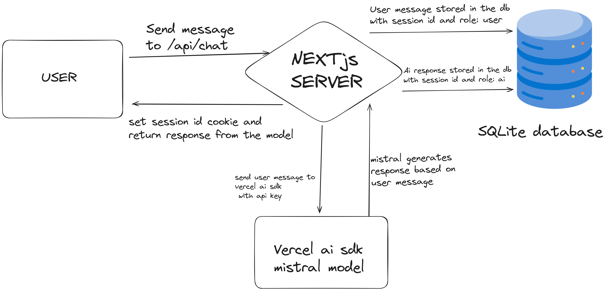
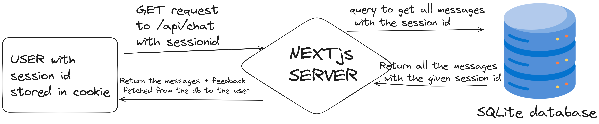
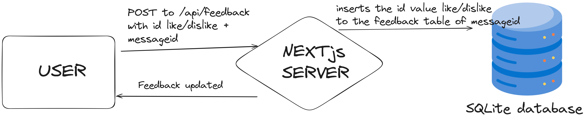

## Getting Started

1.  First, run the development server:

```bash
npm install

npm run dev
# or
yarn install

yarn dev
# or
pnpm install

pnpm dev
# or
bun install (preferred)

bun dev
```

2.  Follow the .env.example and create a .env.local file

Open [http://localhost:3000](http://localhost:3000) with your browser to see the result.

You might face errors like could not locate the .bindings file. In this case run

```bash
npm rebuild sqlite3
```

Here's how the application works for first time users


For users who have used the app before here's how it works


Here's how the feedback works


## Demo video

https://github.com/Sama-004/vercel-ai-sdk/assets/70210929/002f34b5-1cef-4fd3-a9db-65de8d8e6a43
